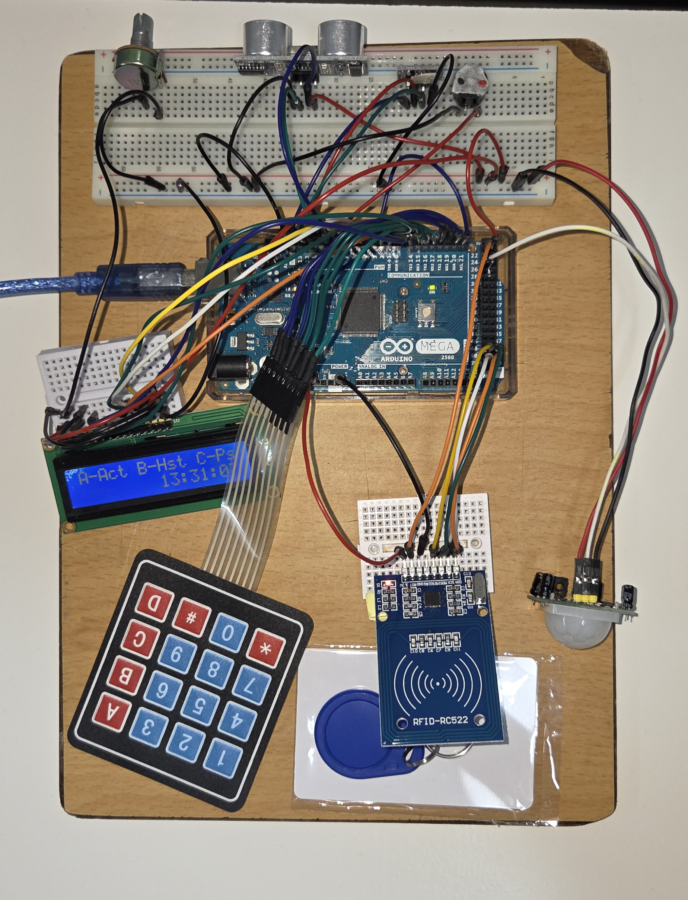

# 🛡️ Arduino Mega 2560 Alarm System

A compact and powerful **Arduino Mega 2560 alarm system** that combines **RFID authentication**, **PIR motion detection**, and **Ultrasonic distance sensing** to secure your area.  
The system integrates an LCD interface, keypad controls, RGB LED indicators, and a dynamic siren for an engaging and functional security experience.

---

## 🚀 Key Features

- **Dual Authentication:** Activate or disarm the alarm using either a **password** or an **RFID tag**.  
- **Multi-Zone Detection:**
  - **Area 1:** Ultrasonic sensor for object proximity.
  - **Area 2:** PIR sensor for human motion.
- **Real-Time LCD Display:** Shows current time, motion area, and system status.
- **Visual & Audible Alerts:** RGB LED police-style flashing and buzzer siren when intrusion is detected.
- **Password Management:** Change password directly from the keypad.
- **Alarm History:** Logs the last 5 alarms with activation, deactivation, and trigger time.
- **User Controls:**
  - `A` → Activate Alarm  
  - `B` → View/Clear History  
  - `C` → Change Password  
  - `D` → Toggle PIR Polarity  

---

## 🧩 Components Used

| Component | Pin(s) | Description |
|------------|--------|-------------|
| **LCD (16x2)** | Pins 1, 2, 4–7 | Display status and time |
| **Keypad (4x4)** | Pins 14–21 | User input |
| **Buzzer** | Pin 8 | Siren alert |
| **Ultrasonic Sensor (HC-SR04)** | Trig 9, Echo 10 | Distance detection |
| **PIR Sensor** | Pin 26 | Motion detection |
| **RGB LED** | R-11, G-12, B-13 | Status indication |
| **RFID (MFRC522)** | RST 22, SS 53, SPI | Tag authentication |

---

## 🖼️ Circuit Diagrams

| Description | Image |
|--------------|--------|
| **System Diagram** |  |
| **Actual Build** |  |

---

## ⚙️ Operation Summary

1. **Idle Mode:** Displays menu and clock. Motion from sensors is indicated briefly.  
2. **Activate Alarm (A):** Authenticate, wait for countdown → Alarm armed.  
3. **Intrusion Detection:** Triggers siren and flashing LEDs.  
4. **Disarm:** Use RFID or password.  
5. **View History (B):** Scroll through recent alarm logs.  
6. **Change Password (C):** Securely update access code (Default: 1234).  
7. **PIR Mode (D):** Switch between Active HIGH/LOW configurations.
